## CI/CD for sample note taking web application

This assignment explores an implementation of CI/CD for a sample note taking web application.

- Go backend API
- React frontend client

### Running locally

From root (currently api is fully available within Docker)

```
docker compose up --build
```

If everything runs successfully, you should be able to navigate to `http://localhost:3000` to view the UI

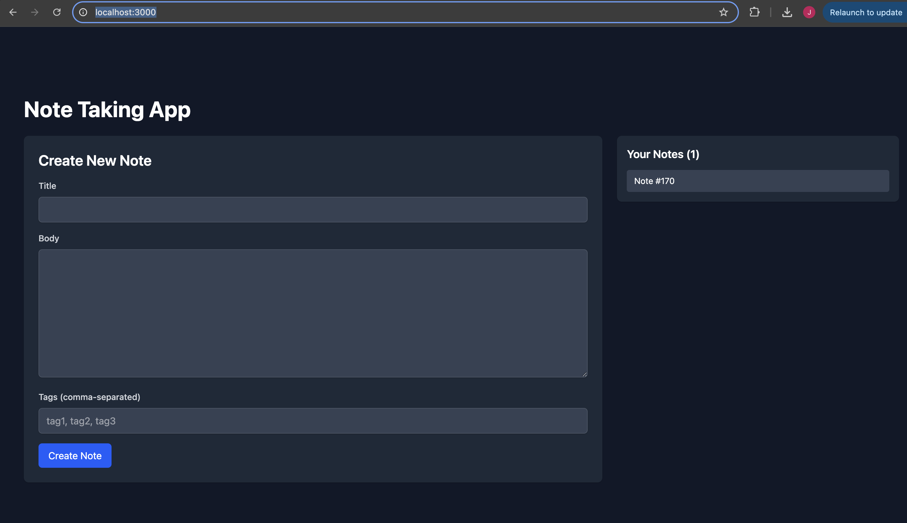

And to view the prometheus UI, you can navigate to `http://localhost:9090`

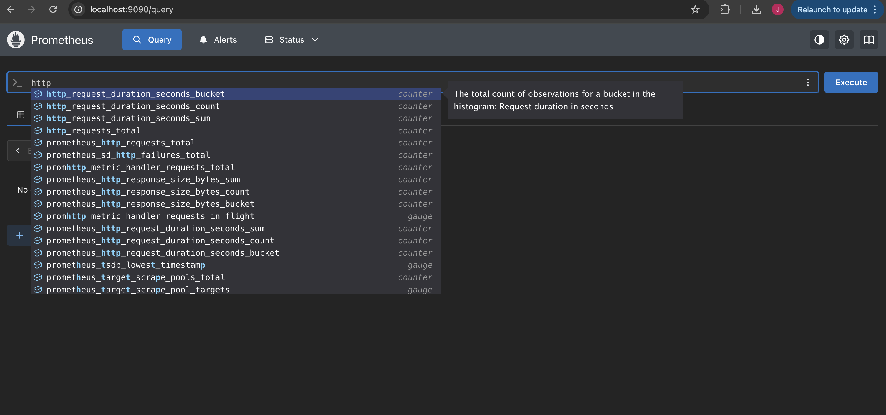

And to view the Grafana Dashboard, navigate to `http://localhost:3001`

Which will show a login

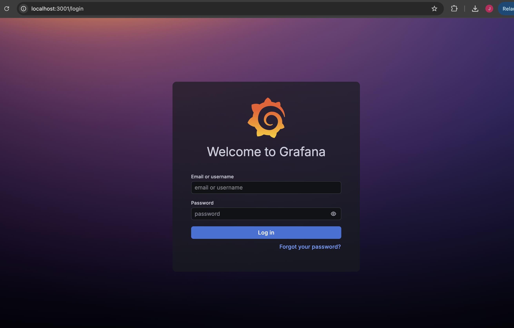

You can enter the following

Username: admin
Password: admin

Then you will be prompted to select a new password.

Once you have done that, you will be logged in.

Then you can navigate to the Grafana dashboard.

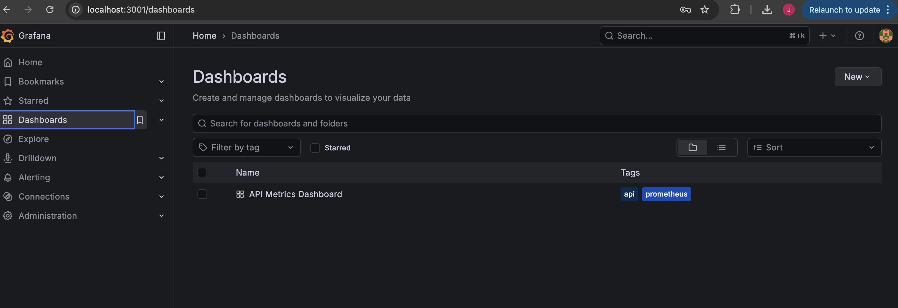

And then view the dashboard by clicking on it.

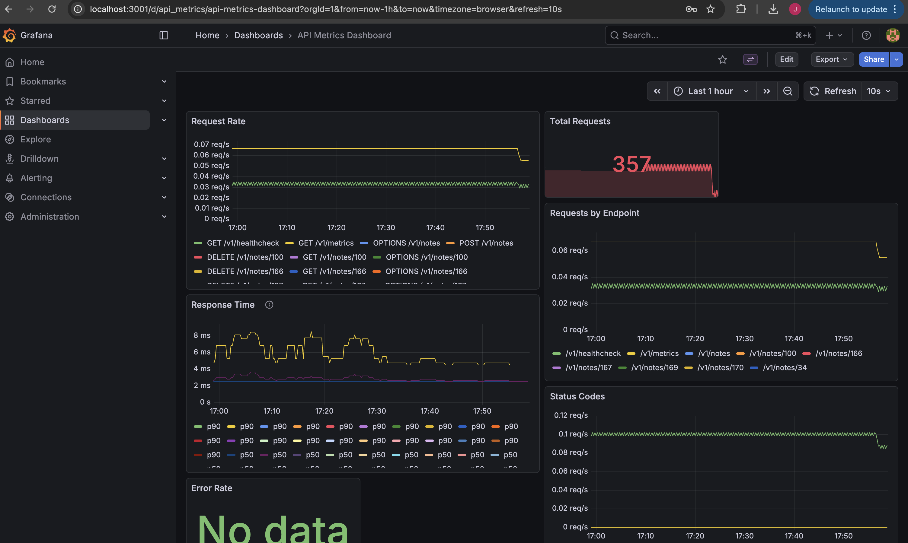


## Architecture

There are two different Terraform architectures in this repo.

- setup
- deploy

The setup workspace is used to provide the resources needed for the environment deployment to take place. Primarily, this consists of creating the IAM user in use in the GitHub Actions pipeline with the required permissions to deploy the Terraform resources.

The deploy workspace is used to provision and configure the resources needed for the target infrastructure such as VPC, subnets, load balancer, route 53 configuration etc.

## Setup

You can fork the repo to get this infrastructure up and running.

### Remote backend pre-requisites

Assumption that AWS in use for remote backend as provider for this assignment is AWS.

To setup a remote backend (which stores the Terraform state and assigns locks when applying state to avoid developers overwriting each other), an s3 bucket and dynamo db table need to be created in AWS.

#### S3 bucket

First setup s3 bucket (note you will need to use a different bucket name as it needs to be globally unique in AWS).

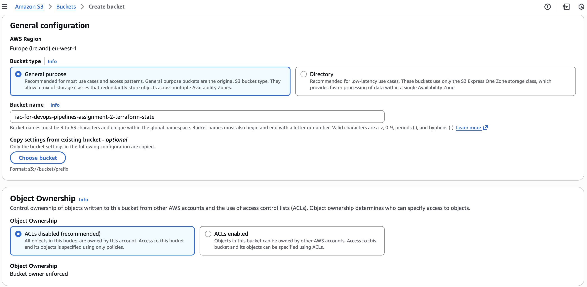

For security, all public access should be blocked.

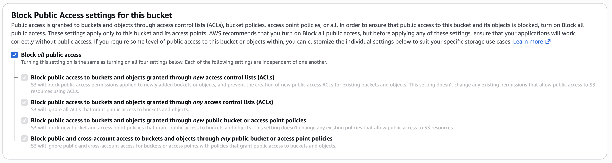

Enable bucket versioning to allow an audit trail of changes made to state

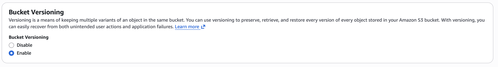

Use default encryption settings.

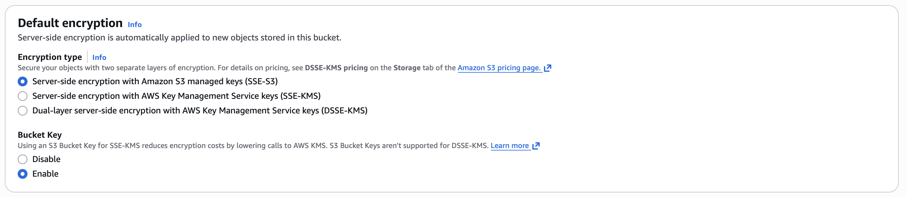

#### Dynamo DB table

A dynamo db table also needs to be created for the remote backend. Add a different table name and add 'LockID' as the partition key.

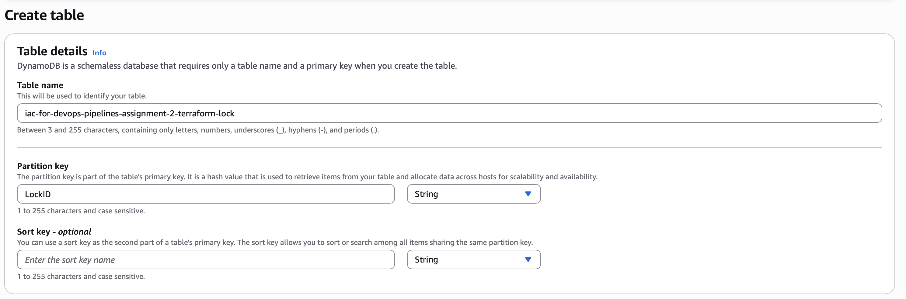

Use default settings for all other toggles.

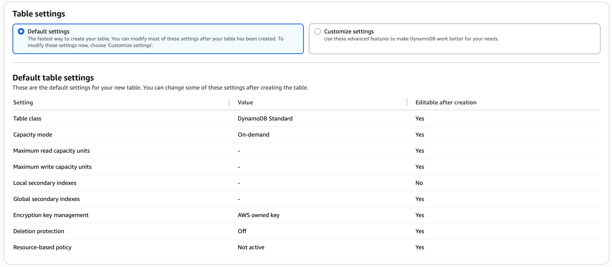

### GitHub Actions secrets & variables

A number of secrets and variables are used in the pipelines to enable secure access to Docker Hub and AWS.

#### Secrets

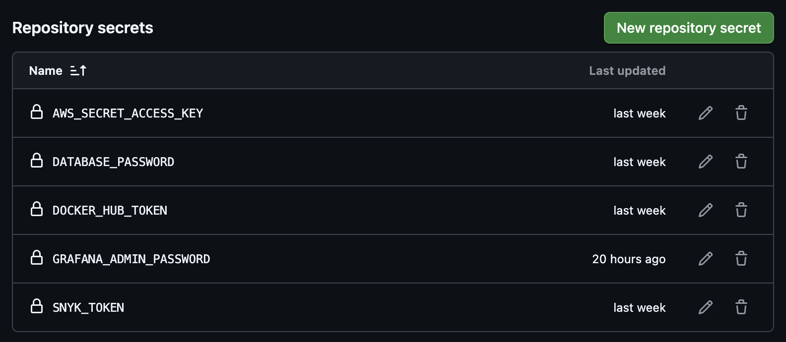

An account is needed on Docker Hub to enable greater rate limits for accessing Docker in pipelines.

More information on creating a Personal Access Token within the account for use can be found [here](https://docs.docker.com/security/access-tokens/).

The AWS secret access key is obtained when creating the IAM user in AWS for use in pipelines from the local machine.

#### Variables

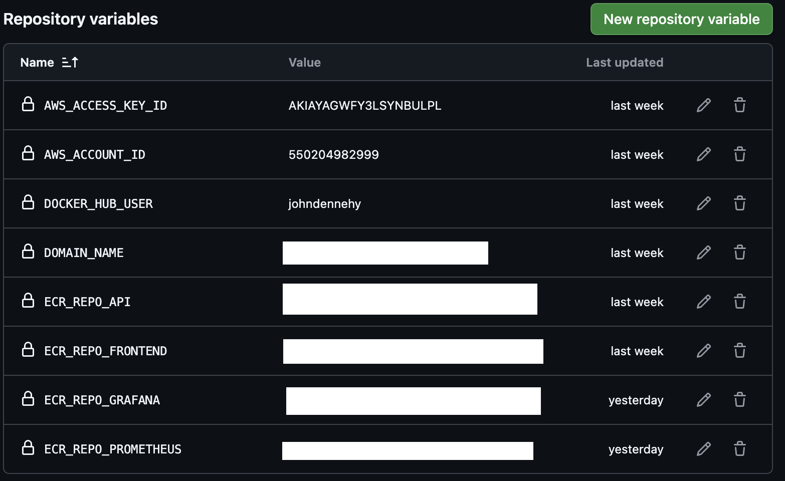

All apart from Docker Hub user are obtained when creating the IAM user in AWS for use in pipelines from the local machine.

The secret is a sensitive value so will not be outputted by default (see further below in 'Running' section on how to get resources created before doing this step).
Once the setup resources have been provisioned (see 'Running' section below), this can be obtained with the following command.

```
docker compose run --rm terraform -chdir=setup output cd_user_access_key_secret
```

This can be seen in the outputs within the 'setup' subdirectory within 'infra' - https://github.com/JohnDennehy101/devops-atu-software-engineering-assignment-3/blob/main/infra/setup/outputs.tf

```
output "cd_user_access_key_id" {
  description = "AWS key ID for continuous deployment (CD) user"
  value       = aws_iam_access_key.cd.id
}

output "cd_user_access_key_secret" {
  description = "AWS key secret for continuous deployment (CD) user"
  value       = aws_iam_access_key.cd.secret
  sensitive   = true
}

```

On creation of a user in Docker Hub, the username used for creation can be taken from there.

#### Custom Domain

It is also required to purchase a custom domain on route 53 on AWS.

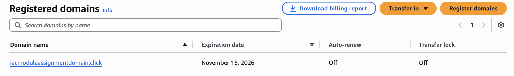

This can be whatever you wish, once you have registered the domain, you will need to update the value in the code [here](https://github.com/JohnDennehy101/devops-atu-iac-for-devops-pipelines-assignment-2/blob/b467d11811f0a86c1356d965269e4d59e1eff3ed/infra/deploy/variables.tf#L22).

## Running

Some pre-requisites to running the state locally

- Docker installed on local machine and running
- Terraform installed on local machine
- AWS vault installed on local machine and configured with profile with admin credentials

Create a branch off of main on this repository.

Update the Terraform code within infra/ directory with the s3 bucket and dynamo db values you created above. Also update the project name and contact email

Open this project in Visual Studio code locally, open terminal.

Navigate to correct directory

```
cd infra
```

Use aws vault to authenticate your local terminal

```
aws-vault exec iamadmin-atu --no-session --duration=8h
```

If successful, that will open a subshell which is authenticated with AWS credentials.

You should then be able to run the following commands to setup the IAM user for the CI/CD pipeline as well as obtaining the ECR repo url needed as a GitHub actions pipeline variable.

```
docker compose run --rm terraform -chdir=setup apply
```

Review the changes, on pop-up of the review box, type 'yes' and click enter.

The outputs should be shown which can then be used to populate the GitHub actions secrets and variables that are needed for the pipeline (as mentioned above).

Then commit your changes, push to the remote and create a pull request.

On creation of a pull request, build, lint, security, Terraform checks will be run to see that code is formatting and valid (terraform checks do not catch all errors but useful to include).

Once checks have passed, merge in the PR and this will trigger a deployment to the staging environment. Once pipeline run is complete, you can obtain the endpoint url by navigating to bottom of pipeline run. This is present as it has been defined in the outputs for the deploy directory.

```
output "static_site_address" {
  value = aws_route53_record.static_site.fqdn
}
```

You can then navigate to this url to view the deployed static site.

That is a successful deploy to the staging environment.

If you wish to create a production deployment (after reviewing that everything is as expected on the staging site), you can create a prod branch on GitHub.

Create a pull request from 'main', targeting 'prod' branch. On creation of the pull request, validation checks will be run. Once passed, merge in the pull request which will trigger the deploy job. Once pipeline run is complete, you can obtain the endpoint url by navigating to bottom of pipeline run. This is present as it has been defined in the outputs for the deploy directory.

This check in the `deploy.yml` workflow determines if the project is a prod or staging deployment (note it does a check on the GitHub ref - this is why creation of PR on prod branch triggeres prod deployment and all others trigger staging deployment.

```
- name: Set variables
        run: |
          if [[ $GITHUB_REF == 'ref/heads/prod' ]]; then
              echo "prod" > .workspace
          else
              echo "staging" > .workspace
          fi
```

